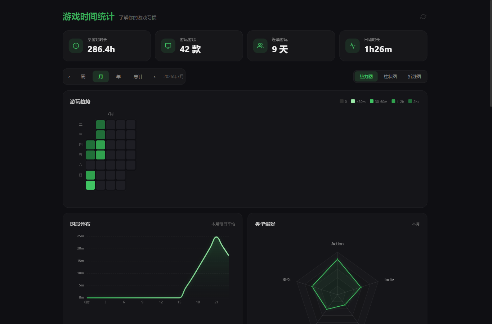
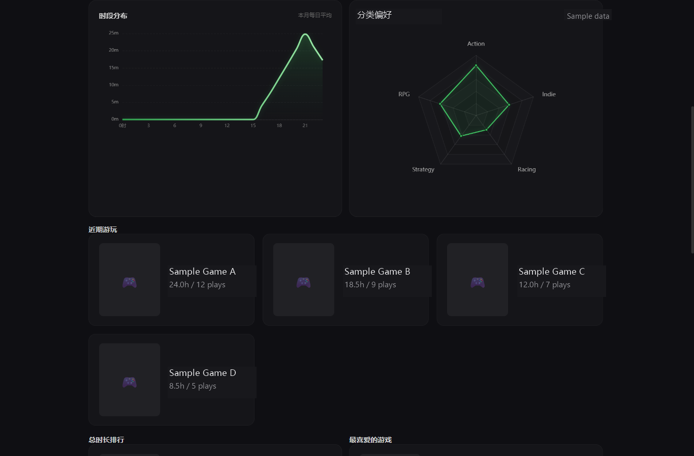

# Game Time Statistics / 游戏时间统计

Game Time Statistics is a Playnite generic plugin for understanding how you spend time in your game library. It opens a standalone statistics dashboard with playtime trends, daily activity, hourly habits, category preferences, and game rankings.

游戏时间统计是一个 Playnite 通用插件，用于了解你在游戏库中的时间分配。插件会打开独立统计面板，展示游玩趋势、每日活跃情况、时段习惯、分类偏好和游戏排行。

## Features / 功能

- **Standalone dashboard**: Open the statistics window from Playnite's top panel without requiring a custom theme slot.
- **Session tracking**: Record Playnite game sessions and recover sessions that were interrupted by a restart or unexpected exit.
- **Multiple time ranges**: Review data by week, month, year, or all time.
- **Several visualizations**: Switch between heatmap, bar chart, and line chart views for play trends.
- **Play habit analysis**: See daily averages, hourly distribution, current streak, and category preferences.
- **Game lists**: Browse recently played games, games played most, and highly rated favorites.
- **Steam enrichment**: Read local Steam userdata when available and optionally import additional data through the Steam Web API.
- **Transparent data sources**: Distinguish exact Playnite sessions, recovered sessions, Steam deltas, and historical estimates in the dashboard.
- **Local-first storage**: Keep statistics and settings in Playnite's plugin user data directory.

- **独立统计面板**：从 Playnite 顶部面板打开统计窗口，不需要占用自定义主题槽位。
- **会话记录**：记录 Playnite 游戏会话，并恢复因重启或异常退出而中断的会话。
- **多种时间范围**：按周、月、年或全部时间查看数据。
- **多种图表视图**：在热力图、柱状图和折线图之间切换，查看游玩趋势。
- **游玩习惯分析**：查看日均时长、时段分布、连续游玩天数和分类偏好。
- **游戏列表**：浏览近期游玩的游戏、累计时长最高的游戏和高评分喜爱游戏。
- **Steam 数据补充**：在可用时读取本机 Steam userdata，也可以选择通过 Steam Web API 导入额外数据。
- **数据来源透明**：在面板中区分 Playnite 精确会话、恢复会话、Steam 差量和历史估算数据。
- **本地优先存储**：统计数据和设置保存在 Playnite 的插件用户数据目录中。
  
**Note:**

1. Historical data will be estimated based on data from Playnite and Steam, and then incorporated into the charts. (Extrapolating backwards from the last run time, with uneven time distribution — please understand that the estimation won't be perfectly precise.) (To connect Steam data, you need to set the Steam ID and API in this Playnite plugin.)

2. If you forget to launch via Playnite, you can sync the Steam playtime in Playnite after finishing a game, then click the plugin's update button to update and record the playtime. The logic is: based on the game's last run time on Steam, the time difference is attributed to that last run time. So, as long as you update before the next play session, you'll get an accurate record.

3. There are 5 types of charts: Heatmap, Bar Chart, Line Chart, Radar Chart, and Time Distribution Chart.

4. There are 3 types of leaderboards: Recently Played, Total Playtime Ranking, and Most Favorite Games (ranked by rating). Each leaderboard displays a maximum of 6 entries.

5. The play count recorded on game cards is only tracked when the game is launched through Playnite.
**注意：**
1、以前的数据会根据playnite和steam的数据进行推算，而兼容到图表中。（最后运行时间往前推，时长不均匀分布，推算做不到太精确，见谅）（要连接 steam 数据的话要在 playnite 的这个插件中设置 steamid 和 api）
2、如果忘了用 playnite 启动，可以玩完游戏后同步一下 playnite 的 steam 时长，然后点击插件的更新按钮即可更新并记录时长。逻辑是根据 steam 游戏的最后运行时间，将差异小时归到最后运行时间，所以在下一次游玩前更新一下即可获得准确的记录。
3、图表有5种，热力图、柱状图、折线图、雷达图、时段分布图。
4、有3种榜单，最近游玩、总时长排行、最喜爱游戏（根据评分来排的），每个榜单最多显示6个。
5、游戏卡片中次数的记录需要用 playnite 启动游戏才记录。
## Screenshots / 截图

The screenshots below use anonymized sample data.

以下截图使用脱敏示例数据。



*Overview dashboard / 主面板*



*Category preference radar and recent games / 分类偏好雷达图与近期游玩*

## Installation / 安装

Install from Playnite's add-on browser after the add-on database pull request is merged, or download the `.pext` package from a GitHub Release and install it manually.

插件数据库 PR 合并后，可以从 Playnite 插件浏览器安装；也可以从 GitHub Release 下载 `.pext` 安装包并手动安装。

## Steam Data / Steam 数据

Local Steam data is used when available. Online Steam sync is optional and disabled by default. To enable it, provide a Steam Web API key and SteamId64 in the plugin settings. If SteamId64 is left blank, the plugin attempts to infer it from local Steam userdata.

插件会在可用时读取本机 Steam 数据。在线 Steam 同步为可选功能，默认关闭。启用后，请在插件设置中填写 Steam Web API Key 和 SteamId64。SteamId64 留空时，插件会尝试从本机 Steam userdata 自动推断。

## Privacy / 隐私说明

The plugin does not include telemetry or third-party analytics. It stores `sessions.json`, `steam-snapshots.json`, generated web UI files, and plugin settings locally in Playnite's plugin user data directory.

插件不包含遥测或第三方分析功能。插件会将 `sessions.json`、`steam-snapshots.json`、生成的 Web UI 文件和插件设置保存在 Playnite 的插件用户数据目录中。

When online Steam sync is enabled, the plugin sends requests to Steam Web API endpoints using the configured API key and SteamId64. No Steam data is sent anywhere when online sync is disabled, apart from any local Steam data access needed to read available files.

启用在线 Steam 同步后，插件会使用配置的 API Key 和 SteamId64 请求 Steam Web API。关闭在线同步时，除读取本机可用的 Steam 文件外，插件不会向外部发送 Steam 数据。

## Development / 开发

Requirements:

- .NET SDK capable of building `net481`
- Playnite SDK files in the repository root, matching the current references
- Playnite Toolbox for packaging and manifest validation

Build:

```powershell
dotnet build src\PlayniteGameStats.csproj -c Release
```

Prepare a release staging directory and package:

```powershell
.\scripts\prepare-release.ps1 -GithubUser YOUR_GITHUB_USER
```

If `Toolbox.exe` is not on `PATH`, pass its full path:

```powershell
.\scripts\prepare-release.ps1 -GithubUser YOUR_GITHUB_USER -ToolboxPath "C:\Path\To\Toolbox.exe"
```

Before publishing, update the GitHub user or organization in `extension.yaml`, `LICENSE`, `manifests\installer.yaml`, and `manifests\addon-database.yaml`.

正式发布前，请更新 `extension.yaml`、`LICENSE`、`manifests\installer.yaml` 和 `manifests\addon-database.yaml` 中的 GitHub 用户名或组织名。

## Release Checklist / 发布检查

- Update metadata and `CHANGELOG.md` for the target version.
- Run `dotnet build src\PlayniteGameStats.csproj -c Release`.
- Run `.\scripts\prepare-release.ps1 -GithubUser baozhidaoa`.
- Upload the generated `.pext` package to the matching GitHub Release.
- Verify the installer and add-on database manifests with Playnite Toolbox.
- Copy `manifests\addon-database.yaml` to `addons/generic/` in a fork of [PlayniteAddonDatabase](https://github.com/JosefNemec/PlayniteAddonDatabase) and open a pull request.

## Links / 链接

- [GitHub repository / GitHub 仓库](https://github.com/baozhidaoa/playnite-game-time-stats)
- [Playnite extension manifest documentation / Playnite 扩展清单文档](https://api.playnite.link/docs/tutorials/extensions/extensionsManifest.html)
- [Playnite Toolbox documentation / Playnite Toolbox 文档](https://api.playnite.link/docs/tutorials/toolbox.html)
- [Playnite Add-on Database / Playnite 插件数据库](https://github.com/JosefNemec/PlayniteAddonDatabase)
